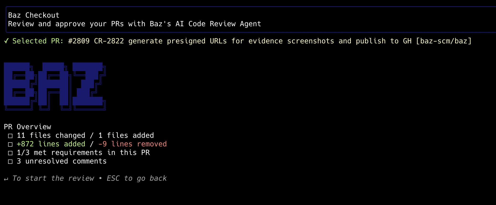
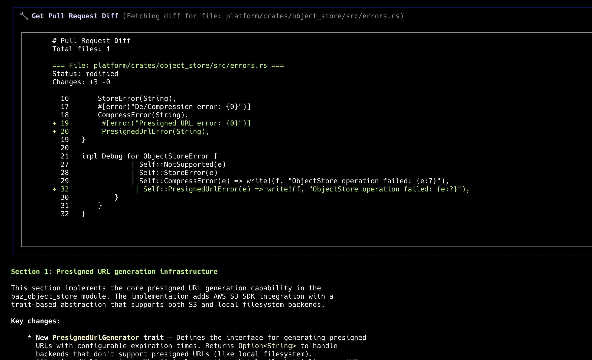
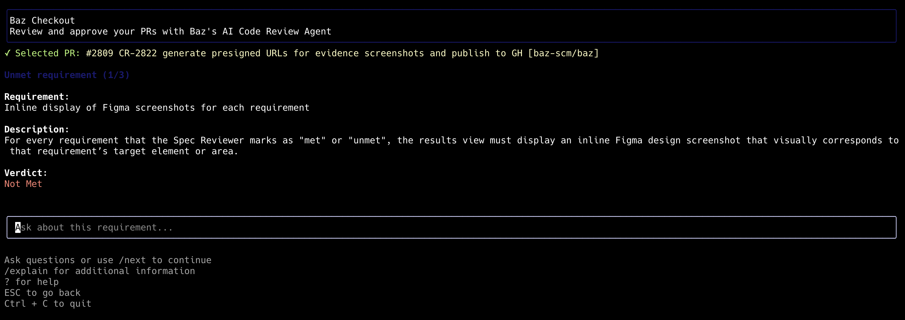

<div align="center">

# Baz CLI


**Review what matters, skim through the rest**  
*Let AI guide you through the review*

   [](https://github.com/baz-scm/baz-cli/actions)
[](https://nodejs.org/)
[](https://www.typescriptlang.org/)

</div>

---

## The Problem: Code Review is the New Bottleneck

AI has revolutionized software development. With AI assistants, developers can write code faster than ever, generating entire features, refactoring complex systems, and implementing patterns in minutes instead of hours. But as development velocity accelerates, **code review has become the bottleneck**.

While AI helps you write code at unprecedented speed, human reviewers still need to review every change, understand context, catch edge cases, and ensure quality. This creates a frustrating mismatch: you can ship tons of code, but reviews take hours or days.

### ✨ How Baz CLI Changes That

**Let AI guide you through reviews**, helping you focus on what matters while skimming through the rest. Get intelligent insights, automated analysis, and context-aware suggestions, thoughtful and logical ordering that lets you get through all those reviews fast - **all in your terminal!**

## Table of Contents

- [Two Ways to Use Baz CLI](#two-ways-to-use-baz-cli)
  - [Standalone Mode (Bring your own keys)](#-standalone-mode-bring-your-own-keys)
  - [Integrated Mode (Baz Experience)](#-integrated-mode-baz-experience)
- [Quick Start](#-quick-start)
- [Features](#-features)
- [Requirements](#requirements)
- [Review Flow](#review-flow)
- [Environment Variables](#environment-variables)
- [Development](#-development)
- [Contributing](#-contributing)
- [Links](#-links)

### Baz CLI in Action

*Interactive CLI experience with real-time AI chat*



*Step-by-step review workflow*



*Understand the gist - does the PR fulfil its objectives?*



## Two Ways to Use Baz CLI

Baz CLI offers two modes to fit your workflow:

### 🔑 Standalone Mode (Bring your own keys)

Use your own GitHub Personal Access Token (PAT) and Anthropic API key to review any pull request directly.

**Perfect for:**
- Reviewing PRs without Baz service integration
- Your data remains yours

**Setup:**
```bash
npm i -g @baz-scm/cli
GH_TOKEN=your_github_pat ANTHROPIC_TOKEN=your_anthropic_api_key baz
```

### 🚀 Integrated Mode (Baz Experience)

Connect with [Baz](https://baz.co/login) to get the full experience: AI assistant, spec review, better context, and comprehensive code review.

> 💡 **New to Baz?** [Sign up for a free 14-day trial](https://baz.co/login) - no credit card required!

**Perfect for:**
- Teams using Baz for code review workflows
- Integrated issue tracking and spec reviews to lead the review
- Collaborative review processes

**Setup:**
```bash
npm i -g @baz-scm/cli
baz
```


## 🚀 Quick Start

```bash
# 1. Install globally
npm i -g @baz-scm/cli

# 2. Optional - Run using your keys. If you have a baz account, skip this step
export GH_TOKEN=your_github_pat
export ANTHROPIC_TOKEN=your_anthropic_api_key

# 3. Run a review
baz
```

---

## ✨ Features

### 🎯 Core Features

- **🤖 AI-Guided PR Walkthrough** – Let AI guide you through pull requests with intelligent, context-aware navigation
- **📖 Read Summaries, Diffs, and Open Comments** – View comprehensive PR summaries, examine code diffs, and see all existing comments in one place
- **💬 Create Comments, Approve, and Merge** – Take action directly from the CLI: add comments, approve PRs, and even merge when ready

### 🚀 For Baz Users (Integrated Mode)

- **🔗 Integrated Context with Your Ticketing System** – Connect with Jira, Linear, or YouTrack to see related tickets and understand the full context of each PR
- **📋 Spec Reviews** – Understand how each PR meets requirements with AI-powered spec review that validates implementation against ticket specifications

---


### Requirements

- **Node.js** 22 or later (see `engines` in `package.json`)
- **Standalone Mode**: GitHub PAT and Anthropic API key
- **Integrated Mode**: Account in [Baz](https://baz.co/login)
- **Optional**: Jira, Linear, YouTrack etc integrated in baz for ticket context


#### Review Flow

1. **Pull Request Selection** – Choose the PR to review (use back option to change repository)
2. **Review Step Selection** – Choose to let the AI walk you through the PR, or drive the review yourself and ask the AI questions - it's your call!
3. **Review Actions** – Finally - create comments, approve and even merge the PR.

---

### Environment Variables

The CLI respects the following environment variables:

- `LOG_LEVEL` – Set logging verbosity (`fatal`, `error`, `warn`, `info`, `debug`)
- `NODE_ENV` – Environment mode (`development`, `production`)
- All configuration variables above

**Mode Detection:**
- If both `GH_TOKEN` and `ANTHROPIC_TOKEN` are set → **Standalone mode**
- If neither token is set → **Integrated mode** (requires a baz user)
- If only one token is set → Error (both tokens required for standalone mode)

Environment variables are read at runtime, so you can adjust them without rebuilding the CLI.


## 🛠️ Development

### Prerequisites

- Node.js 22+
- npm
- Git

### Setup

Clone the repository and install dependencies:

```bash
git clone https://github.com/baz-scm/baz-cli.git
cd baz-cli
npm install
```

### Available Scripts

| Script | Description |
|--------|-------------|
| `npm run dev` | Start the CLI in watch mode with `tsx` for rapid iteration |
| `npm run build` | Generate compiled output in `dist/` using TypeScript |
| `npm run lint` | Run ESLint checks with caching |
| `npm run lint:fix` | Auto-fix ESLint issues |
| `npm run format:check` | Verify source files with Prettier |
| `npm run format:fix` | Format source files with Prettier |

### Development Workflow

1. Create a `.env` file with your local configuration
2. Run `npm run dev` to start in watch mode
3. Make your changes – TypeScript will compile automatically
4. Test your changes with `npm run dev`
5. Run `npm run lint:fix` and `npm run format:fix` before committing


## 🤝 Contributing

We welcome contributions! Here's how you can help:

1. **Fork the repository** and create your branch from `main`
2. **Make your changes** following our code style
3. **Test thoroughly** – ensure all existing tests pass
4. **Submit a pull request** with a clear description of your changes

### Code Style

- Follow the existing code style and conventions
- Run `npm run lint:fix` and `npm run format:fix` before committing
- Write clear commit messages
- Add tests for new features when applicable

### Reporting Issues

Found a bug or have a feature request? [Open an issue](https://github.com/baz-scm/baz-cli/issues) and we'll take a look!


## 🔗 Links

- **GitHub**: [baz-scm/baz-cli](https://github.com/baz-scm/baz-cli)
- **NPM Package**: [@baz-scm/cli](https://www.npmjs.com/package/@baz-scm/cli)
- **Baz on GitHub**: [baz-scm](https://github.com/baz-scm/)

---

<div align="center">

Made with ❤️ by the Baz team

[⭐ Star us on GitHub](https://github.com/baz-scm/baz-cli) if you find this project helpful!

</div>
